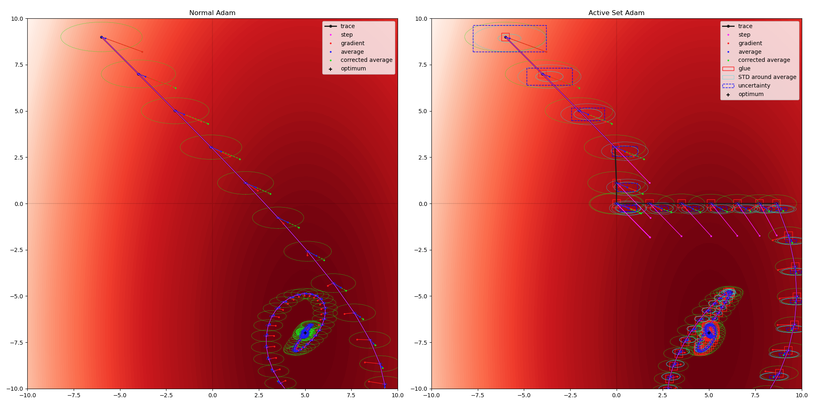

# Active Set Adam

[ _Figure generated by [demo.py](./demo.py)._ ]

Adds features for L1-regularisation based on uncertainty estimates. Maintains an active set of dimensions, activation and deactivation is coupled to the L1 regularisation. For `l1` and `glue` both set to `None` (default) it behaves like Adam and can thus be used as a drop-in replacement.